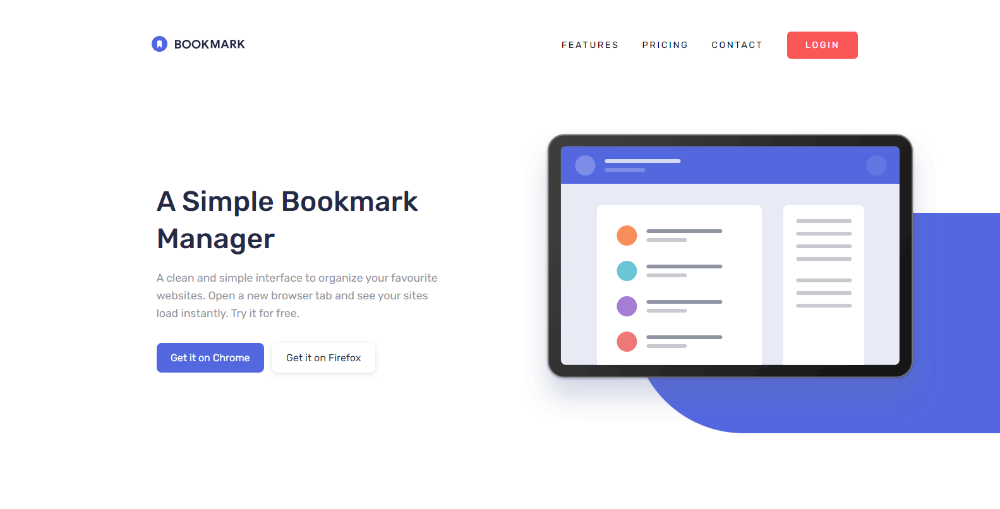

# Frontend Mentor - Bookmark landing page solution

This is a solution to the [Bookmark landing page challenge on Frontend Mentor](https://www.frontendmentor.io/challenges/bookmark-landing-page-5d0b588a9edda32581d29158). Frontend Mentor challenges help you improve your coding skills by building realistic projects. 

## Table of contents

- [Overview](#overview)
  - [The challenge](#the-challenge)
  - [Screenshot](#screenshot)
  - [Links](#links)
- [My process](#my-process)
  - [Built with](#built-with)
  - [What I learned](#what-i-learned)
  - [Continued development](#continued-development)
  - [Useful resources](#useful-resources)
- [Author](#author)

## Overview

### The challenge

Users should be able to:

- View the optimal layout for the site depending on their device's screen size
- See hover states for all interactive elements on the page
- Receive an error message when the newsletter form is submitted if:
  - The input field is empty
  - The email address is not formatted correctly

### Screenshot



### Links

- Solution URL: [https://github.com/LucaJahnen/bookmark-landing-page](https://github.com/LucaJahnen/bookmark-landing-page)
- Live URL: https://bookmark-landing-page354.netlify.app

## My process

### Built with

- Semantic HTML5 markup
- vanilla css and vanilla js
- Mobile-first workflow
- Tested with Google Lighthouse

### What I learned

```html
<details>
  <summary data-index="0" data-clicked="false">
    <p>What is Bookmark?</p>
    <div>
      <svg/></svg>
    </div>
  </summary>
  <p>Lorem ipsum dolor sit amet.</p>
</details>
```

This project required a faq-section which is built using the details and summary tag. I never built this kind of section before so it was my first time using these elements. I also decided to use data-attributes to store the state of each element because in my opinion data-attributes are quite easy to use.

### Continued development

In the future I want to continue building landing pages like this one using the challenges provided by frontendmentor. I would also like to improve my knowledge about react thus I want to complete one of frontendmentor's challenges using react or I might choose to complete one of the challenges provided by TheOdinProject.

### Useful resources

Concering this challenge I had to use RegEx to validate that the email input really is a valid email. I had never done form validation with RegEx and therefore looked it up on stackoverflow where I could find this useful solution: [https://stackoverflow.com/questions/46155/how-can-i-validate-an-email-address-in-javascript](https://stackoverflow.com/questions/46155/how-can-i-validate-an-email-address-in-javascript)

After further research I also found this article about RegEx by Samyak Jain on FreeCodeCamp: [https://www.freecodecamp.org/news/regex-in-javascript/](https://www.freecodecamp.org/news/regex-in-javascript/)

## Author

- Github - [@LucaJahnen](https://github.com/LucaJahnen)
- Frontend Mentor - [@LucaJahnen](https://www.frontendmentor.io/profile/LucaJahnen)
